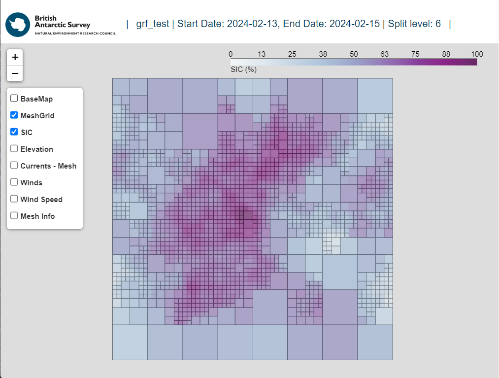

# Examples

Digital environment files (meshes) can be created using the MeshiPhi package, either through the
command line interface (CLI) or through the python terminal. This section will provide examples of how to create a digital 
environment file using Python.
 
## Creating the Digital Environment.

A configuration file is needed to initialise the `Mesh` object which forms the digital environment. This
configuration file is of the same format used in the :ref:`create_mesh` CLI entry-point, and may either be loaded from a
*json* file or constructed within a python interpreter.

Loading configuration information from a `json` file:

```py
import json
with open('examples/environment_config/grf_example.config.json', 'r') as f:
    config = json.load(f)    
```

The digital environment `Mesh` object can then be initialised. This mesh object will be constructed using parameters in it
configuration file. This mesh object can be manipulated further, such as increasing its resolution through further 
splitting, adding additional data sources or altering is configuration parameters using functions listed in 
the :ref:`Methods - Mesh Construction` section of the documentation. The digital environment `Mesh` object can then be cast to
a json object and saved to a file. 

```py
from meshiphi.mesh_generation.mesh_builder import MeshBuilder

cg = MeshBuilder(config).build_environmental_mesh()

mesh = cg.to_json()
```

The `Mesh` object can be visualised using the [GeoPlot](https://github.com/bas-amop/GeoPlot package, also developed
by BAS. This package is not included in the distribution of MeshiPhi, but can be installed using the following command:

```py
pip install bas_geoplot
```

**GeoPlot** can be used to visualise the `Mesh` object using the following code in an iPython notebook or
any python interpreter:

```py
    
from bas_geoplot.interactive import Map

mesh = pd.DataFrame(mesh_json['cellboxes'])
map = Map(title="GRF Example")

map.Maps(mesh, 'MeshGrid', predefined='cx')
map.Maps(mesh, 'SIC', predefined='SIC')
map.Maps(mesh, 'Elevation', predefined='Elev', show=False)
map.Vectors(mesh,'Currents', show=False, predefined='Currents')
map.Vectors(mesh, 'Winds', predefined='Winds', show=False)

map.show()
```

The prior should produce a plot which shows the digital environment, including sea ice concentration, elevation, currents and wind.

*The expected output of running bas_geoplot on the GRF example mesh provided:*

