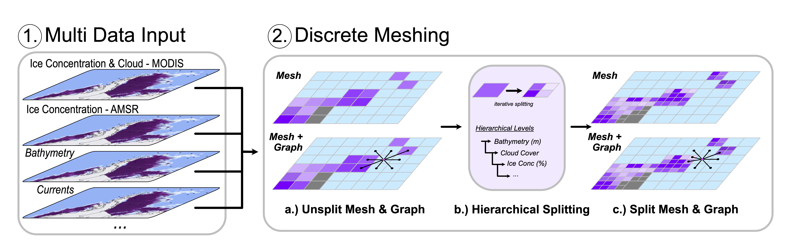
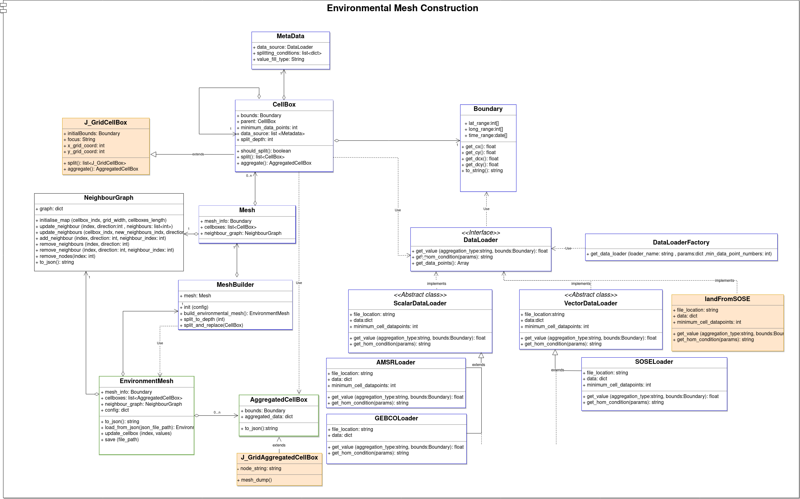
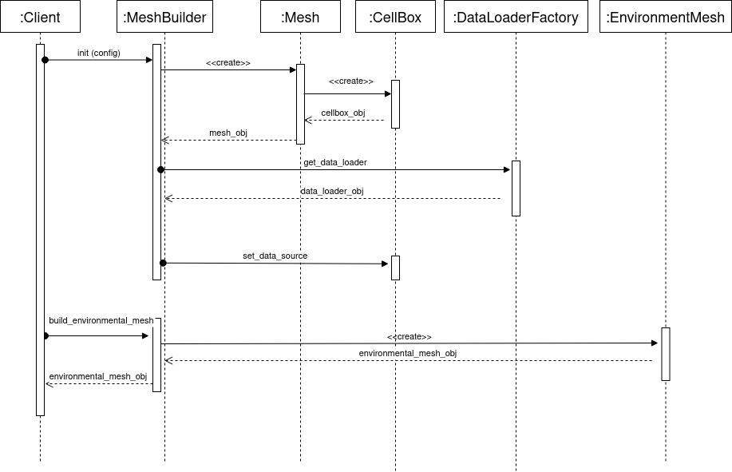
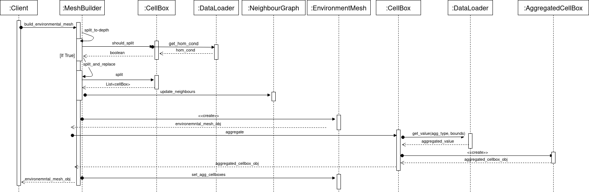

# Methods - Mesh Construction

Throughout this section we will outline an overview of the Environment Mesh Construction 
module, describe the main classes that composes the module and illustrate a use case for 
the Discrete Meshing of the environment.

## Mesh Construction - Overview

A general overview of the method can be seen below:

Overview figure of the Discrete Meshing from the multi-data input.

## Mesh Construction Design

The below UML diagram describes how the Environment Mesh Construction module is designed. 
It depicts the classes of the module and how they interact with each other.

 
## Mesh Construction Use case

This sequence diagram illustrates a use case for the Discrete Meshing of the environment, 
where the module's client starts by initializing the MeshBuilder with a certain mesh 
configuration (see Input-Configuration section for more details about the configuration format) 
then calls build_environment_mesh method.

The following diagram depicts the sequence of events that take place inside build_environment_mesh 
method into details

For a more in-depth explanation of the mesh construction methods, please refer to the [Mesh Construction - Classes](classes.md)
section.
